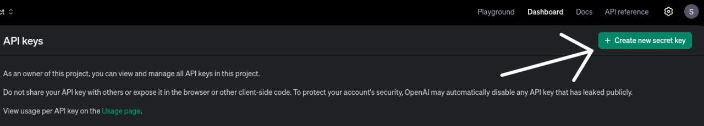
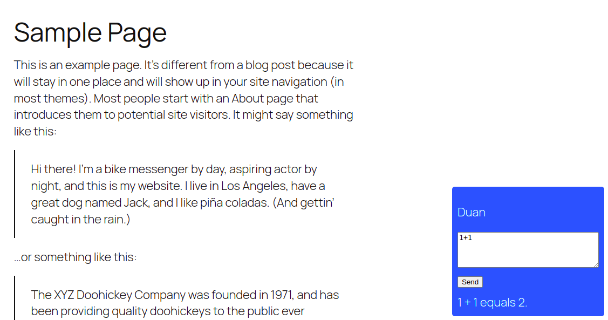

# ChatBoxDuanexCom

## Installation and launch

1. Clone repositories:

   With HTTP
   ```bash
   git clone https://github.com/Duanex-IT/ChatBoxDuanexCom.git
   ```

   With SSH
   ```bash
   git clone git@github.com:Duanex-IT/ChatBoxDuanexCom.git
   ```
2. Install the virtual environment and activate it:
   ```bash
    python3 -m venv venv
    source venv/bin/activate  # For Windows, use `venv\Scripts\activate`
    ```
3. Install all dependencies:
   ```bash
    pip install -r requirements.txt
    ```
4. Fill out your .env file:
   
   Get the API key [here](https://platform.openai.com/api-keys)
   
   Then copy and paste your API Key in the .env file
   ```bash
   OPENAI_API_KEY=...
   ```

5. Start the flask server:
   ```bash
    python flask_api.py
    ```
6. Or you can use Docker and build the image:
    ```bash
    docker build --tag chat-bot .
    ```
    Then run your container with OpenAI API Key:
    ```bash
    docker run -p 5000:5000 -e OPENAI_API_KEY="your_openai_api_key_here" chat-bot
    ```

7. Now open the WordPress. Then go to the section Appearance → Editor and add this code to your web site page:

    HTML
    ```
        <div id="chat-widget" style="position:fixed; bottom:20px; right:20px; background:#007bff; color:white; padding:10px; border-radius:5px;">
        <p>Duan</p>
        <textarea id="user-input" rows="4" cols="30" placeholder="Ask your question..."></textarea><br>
        <button onclick="sendMessage()">Send</button>
        <div id="bot-response" style="margin-top:10px;"></div>
        </div>
    ```
    JS
    ```
    <script>
    function sendMessage() {
    let question = document.getElementById("user-input").value;

    fetch("http://your_ip_address:5000/chat", {
        method: "POST",
        headers: {
        "Content-Type": "application/json"
        },
        body: JSON.stringify({ question: question })
    })
    .then(response => response.json())
    .then(data => {
        document.getElementById("bot-response").innerText = data.answer;
    })
    .catch(error => console.error("Error:", error));
    }

    </script>
    ```
8. In the end you should see this:

    